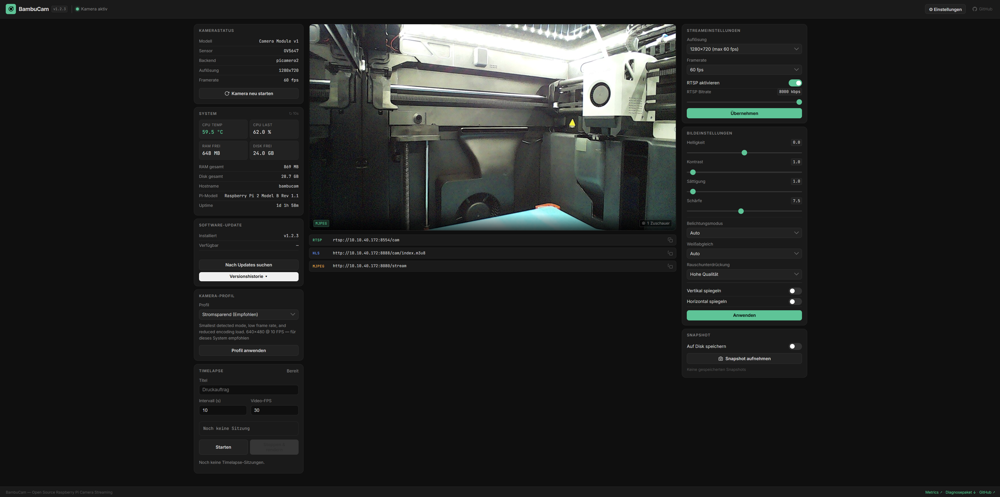

# BambuCam

**Raspberry Pi and USB camera streaming for BambuBuddy, BambuStudio, browsers, Home Assistant, and media players.**

BambuCam turns a Raspberry Pi or compatible Debian computer into a dedicated camera server for a 3D printer. It provides RTSP, MJPEG, HLS, optional WebRTC, snapshots, a responsive WebUI, and a documented REST API.



## Highlights

| Feature | Status |
|---|---|
| Raspberry Pi CSI cameras through picamera2/libcamera | ✅ |
| V4L2 USB webcams | ✅ |
| Automatic camera detection and validated modes | ✅ |
| Hardware-aware automatic resolution and FPS | ✅ |
| MJPEG browser stream | ✅ |
| RTSP through MediaMTX | ✅ |
| HLS and optional WebRTC | ✅ |
| Camera-model-aware controls | ✅ |
| Camera Module 3 autofocus and HDR | ✅ |
| Snapshot storage and downloads | ✅ |
| English/German WebUI with browser-language detection | ✅ |
| REST API | ✅ |
| Optional Basic/Bearer authentication | ✅ |
| Optional HTTPS | ✅ |
| Secure in-place updater | ✅ |
| Hardened systemd service | ✅ |
| Verified release installer | ✅ |

## Supported hardware

### Computers

- Raspberry Pi Zero 2 W
- Raspberry Pi 2, 3, 3B+, 4, and 5
- Debian-based x86-64 or ARM systems with a V4L2 USB webcam

Lower-powered systems automatically receive conservative streaming limits. Raspberry Pi 4 or 5 is recommended for simultaneous high-resolution MJPEG and RTSP/HLS.

### Camera modules

| Module | Sensor | Maximum resolution | Autofocus | HDR |
|---|---|---:|---:|---:|
| Camera Module v1 / NoIR | OV5647 | 2592×1944 | — | — |
| Camera Module v2 / NoIR | IMX219 | 3280×2464 | — | — |
| Camera Module 3 / Wide / NoIR | IMX708 | 4608×2592 | ✅ | ✅ |
| HQ Camera | IMX477 | 4056×3040 | — | — |
| Global Shutter Camera | IMX296 | 1456×1088 | — | — |
| V4L2 USB webcam | varies | detected at runtime | device-specific | device-specific |

## Quick start

### 1. Install the latest release

```bash
curl -fsSL https://github.com/fgrfn/bambucam/releases/latest/download/install.sh | sudo bash
sudo systemctl start bambucam
```

New releases contain a complete installer bundle, wheel, and `SHA256SUMS`. The installer verifies release assets before installation, preserves an existing configuration, and renders the systemd unit for a custom `BAMBUCAM_DIR` when configured.

```bash
# Different installation directory
curl -fsSL https://github.com/fgrfn/bambucam/releases/latest/download/install.sh \
  | sudo BAMBUCAM_DIR=/srv/bambucam bash

# Development branch — not release-checksummed
curl -fsSL https://raw.githubusercontent.com/fgrfn/bambucam/main/scripts/install.sh \
  | sudo BAMBUCAM_BRANCH=main bash
```

See [docs/installation.md](docs/installation.md) for manual verification, upgrades, and uninstallation.

### 2. Open the WebUI

Open:

```text
http://<your-pi-ip>:8080
```

The WebUI uses English by default, automatically follows German browser preferences, and provides a persistent `EN`/`DE` language selector in the header.

### 3. Configure BambuBuddy or BambuStudio

Use the RTSP URL shown by the WebUI:

```text
rtsp://<your-pi-ip>:8554/cam
```

## Stream URLs

The defaults are:

| Protocol | URL | Typical use |
|---|---|---|
| RTSP | `rtsp://<pi-ip>:8554/cam` | BambuBuddy, BambuStudio, VLC, ffplay |
| MJPEG | `http://<pi-ip>:8080/stream` | Browser, OBS, Home Assistant |
| HLS | `http://<pi-ip>:8888/cam/index.m3u8` | Browser players and integrations |
| Snapshot | `http://<pi-ip>:8080/snapshot` | Current JPEG frame |
| Health | `http://<pi-ip>:8080/health` | Service health probe |

RTSP, HLS, WebRTC, stream name, bitrate, and ffmpeg path are configurable. MJPEG is served by the WebUI and therefore shares its port.

## Automatic camera modes

Fresh installations use:

```yaml
camera:
  backend: auto
  resolution: auto
  framerate: auto
```

BambuCam selects a mode from the detected camera capabilities. FPS is capped only by the selected camera mode; explicit user values are never silently reduced based on the Raspberry Pi model. Hardware tiers instead control fresh-install streaming defaults: RTSP in `auto` mode is disabled on Pi Zero/1/2 and enabled on Pi Zero 2 W, Pi 3, Pi 4, and Pi 5. Multiple CSI cameras keep separate capability lists, and `camera.backend` can force `picamera2` or `v4l2`.

## Authentication and HTTPS

WebUI/API protection is optional but recommended on shared networks:

```yaml
web:
  auth:
    enabled: true
    username: admin
    password: "choose-a-long-password"
    api_token: "optional-token-for-integrations"

  https:
    enabled: false
    cert: /etc/ssl/bambucam.crt
    key: /etc/ssl/bambucam.key
```

A plaintext password is migrated to a secure hash on startup. Browsers can use HTTP Basic authentication. Integrations can send:

```http
Authorization: Bearer <api_token>
```

State-changing Basic-auth API requests outside the WebUI must additionally send `X-BambuCam-CSRF: 1`. `/health` remains public for monitoring.

## REST API

All JSON endpoints are below `/api/v1`:

```text
GET    /camera/status
GET    /camera/models
GET    /camera/detect
POST   /camera/settings

GET    /stream/status
POST   /stream/settings
POST   /stream/rtsp/start
POST   /stream/rtsp/stop
POST   /stream/rtsp/settings

GET    /snapshot
GET    /snapshot?save=true
GET    /snapshot/list
DELETE /snapshot/<filename>

GET    /config
POST   /config
GET    /system
POST   /system/restart-camera
POST   /system/restart
POST   /system/reboot

GET    /update/status
POST   /update/check
POST   /update/start
GET    /update/releases
```

Example:

```bash
curl -u admin:password \
  -H 'Content-Type: application/json' \
  -H 'X-BambuCam-CSRF: 1' \
  -d '{"resolution":"1280x720","framerate":30}' \
  http://<pi-ip>:8080/api/v1/camera/settings
```

The configuration API validates the complete typed schema, including unknown nested fields, paths, booleans, port conflicts, image controls, authentication requirements, and streaming limits. Runtime changes and YAML persistence are treated as one transaction: a failure restores the previous in-memory configuration and best-effort runtime state. Credentials are redacted from responses.

## Configuration

System installations use `/etc/bambucam/bambucam.yaml`. User installations default to `~/.config/bambucam/bambucam.yaml`. An explicit `$BAMBUCAM_CONFIG` or `--config` path has highest priority.

See [docs/configuration.md](docs/configuration.md) for the full reference.

## Monitoring and diagnostics

- `GET /health` is a public readiness endpoint and returns HTTP 503 when the camera/stream stack is degraded.
- `GET /metrics` exposes Prometheus text metrics and follows normal WebUI authentication.
- `GET /api/v1/diagnostics` returns a credential-redacted support payload.
- `GET /api/v1/diagnostics/download` downloads redacted JSON and recent in-memory logs as a ZIP.
- Snapshot retention supports count, age, and total-byte limits and can be updated through `/api/v1/snapshot/retention`.

## Updates

The protected WebUI can check, install, and downgrade releases. The updater:

- reserves one update operation atomically;
- limits package and checksum downloads;
- verifies release SHA-256 checksums when available;
- rejects path traversal, links, and device files in source archives;
- checks that the installed package reports the expected version;
- backs up the installed package and runs a clean-process configuration/import health check;
- re-executes the managed process and verifies the expected version through local `/health`;
- automatically restores and restarts the previous package when installation or post-restart health verification fails;
- cleans temporary update data after the guarded restart succeeds.

Existing YAML settings are preserved across releases and migrated by the versioned configuration schema. Settings that require an application restart display a persistent WebUI banner with a restart action.

The release workflow tests Python 3.9–3.12, runs Ruff, Black, ShellCheck, package builds, and publishes checksummed assets only after all checks pass.

## Architecture

```text
CSI camera ── picamera2 ─┬─ JPEG capture ── MJPEG / snapshots
                         └─ H.264 encoder ── MediaMTX ── RTSP/HLS/WebRTC

USB camera ── OpenCV ────┬─ JPEG capture ── MJPEG / snapshots
                         └─ JPEG pipe ── ffmpeg/H.264 ── MediaMTX

Flask WebUI + API controls camera, streams, snapshots, configuration,
health information, authentication, and updates.
```

The USB pipeline opens the V4L2 device only once; ffmpeg receives captured JPEG frames through stdin instead of competing with OpenCV for the camera.

## Development

```bash
git clone https://github.com/fgrfn/bambucam
cd bambucam
python3 -m venv venv
source venv/bin/activate
pip install -e ".[dev]"
pytest tests/
ruff check bambucam tests
black --check bambucam tests
shellcheck scripts/install.sh
```

List cameras without starting the server:

```bash
bambucam --list-cameras
```

## License

MIT — see [LICENSE](LICENSE).
